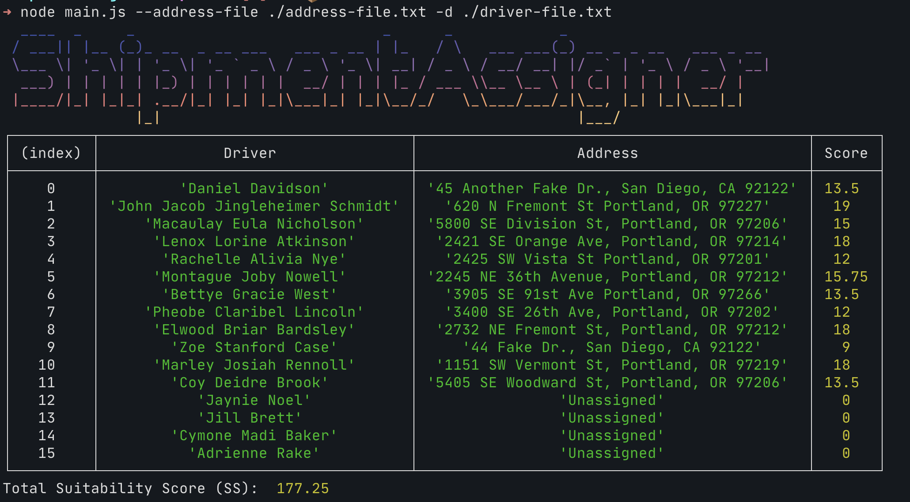

<p align="center">
  
</p>

# ShipmentAssigner

---

### Table of Contents

- [ShipmentAssigner](#shipmentassigner)
  - [Table of Contents](#table-of-contents)
  - [Introduction](#introduction)
  - [Usage / Example](#usage--example)
    - [Assignment (command: `assign`)](#assignment-command-assign)
    - [Test File Generation (command: `generate`)](#test-file-generation-command-generate)
  - [Assumptions](#assumptions)
  - [Approach](#approach)
    - [Calculating the Suitability Score (per the spec)](#calculating-the-suitability-score-per-the-spec)
  - [Build](#build)
    - [Prerequisites](#prerequisites)
    - [Downloading the Code](#downloading-the-code)
    - [Building and Running the Application](#building-and-running-the-application)
  - [Running tests](#running-tests)

## Introduction

`ShipmentAssigner` is an application that assigns shipment destinations to drivers in a way that maximizes the total [Suitability Score](#calculating-the-suitability-score-per-the-spec) over a set of drivers. Each driver can only have one shipment and each shipment can only be offered to one driver.
The program runs on the command line and takes as input two newline separated files, the first containing the street addresses of the shipment destinations and the second containing the names of the drivers. The output is the total SS and a matching between shipment destinations and drivers.

## Usage / Example

The application is invoked from the command line on a Mac or Linux machine. Running the application with `-h / --help` flags will display Usage information:

```
➜ node main.js -h
  ____  _     _                            _      _            _
 / ___|| |__ (_)_ __  _ __ ___   ___ _ __ | |_   / \   ___ ___(_) __ _ _ __   ___ _ __
 \___ \| '_ \| | '_ \| '_ ` _ \ / _ \ '_ \| __| / _ \ / __/ __| |/ _` | '_ \ / _ \ '__|
  ___) | | | | | |_) | | | | | |  __/ | | | |_ / ___ \\__ \__ \ | (_| | | | |  __/ |
 |____/|_| |_|_| .__/|_| |_| |_|\___|_| |_|\__/_/   \_\___/___/_|\__, |_| |_|\___|_|
               |_|                                               |___/
Usage: main [options] [command]

Options:
  -h, --help          display help for command

Commands:
  assign [options]
  generate [options]  Generate input files
  help [command]      display help for command
```

### Assignment (command: `assign`)

If the program is run with valid parameters, a table is printed to stdout with The driver assignments, SS for each assignment, and a total SS score over all the assignments:

```
➜ node main.js assign --address-file ./address-file.txt -d ./driver-file.txt
  ____  _     _                            _      _            _
 / ___|| |__ (_)_ __  _ __ ___   ___ _ __ | |_   / \   ___ ___(_) __ _ _ __   ___ _ __
 \___ \| '_ \| | '_ \| '_ ` _ \ / _ \ '_ \| __| / _ \ / __/ __| |/ _` | '_ \ / _ \ '__|
  ___) | | | | | |_) | | | | | |  __/ | | | |_ / ___ \\__ \__ \ | (_| | | | |  __/ |
 |____/|_| |_|_| .__/|_| |_| |_|\___|_| |_|\__/_/   \_\___/___/_|\__, |_| |_|\___|_|
               |_|                                               |___/
┌─────────┬───────────────────────────────────┬────────────────────────────────────────────┬───────┐
│ (index) │              Driver               │                  Address                   │ Score │
├─────────┼───────────────────────────────────┼────────────────────────────────────────────┼───────┤
│    0    │         'Daniel Davidson'         │ '45 Another Fake Dr., San Diego, CA 92122' │ 13.5  │
│    1    │ 'John Jacob Jingleheimer Schmidt' │   '620 N Fremont St Portland, OR 97227'    │  19   │
│    2    │     'Macaulay Eula Nicholson'     │ '5800 SE Division St, Portland, OR 97206'  │  15   │
│    3    │      'Lenox Lorine Atkinson'      │  '2421 SE Orange Ave, Portland, OR 97214'  │  18   │
│    4    │       'Rachelle Alivia Nye'       │   '2425 SW Vista St Portland, OR 97201'    │  12   │
│    5    │      'Montague Joby Nowell'       │ '2245 NE 36th Avenue, Portland, OR 97212'  │ 15.75 │
│    6    │       'Bettye Gracie West'        │   '3905 SE 91st Ave Portland, OR 97266'    │ 13.5  │
│    7    │     'Pheobe Claribel Lincoln'     │   '3400 SE 26th Ave, Portland, OR 97202'   │  12   │
│    8    │      'Elwood Briar Bardsley'      │  '2732 NE Fremont St, Portland, OR 97212'  │  18   │
│    9    │        'Zoe Stanford Case'        │     '44 Fake Dr., San Diego, CA 92122'     │   9   │
│   10    │      'Marley Josiah Rennoll'      │  '1151 SW Vermont St, Portland, OR 97219'  │  18   │
│   11    │        'Coy Deidre Brook'         │ '5405 SE Woodward St, Portland, OR 97206'  │ 13.5  │
│   12    │           'Jaynie Noel'           │                'Unassigned'                │   0   │
│   13    │           'Jill Brett'            │                'Unassigned'                │   0   │
│   14    │        'Cymone Madi Baker'        │                'Unassigned'                │   0   │
│   15    │          'Adrienne Rake'          │                'Unassigned'                │   0   │
└─────────┴───────────────────────────────────┴────────────────────────────────────────────┴───────┘
Total Suitability Score (SS):  177.25
```

### Test File Generation (command: `generate`)

Test files can be generated using the CLI:

```
➜ node main.js generate
  ____  _     _                            _      _            _
 / ___|| |__ (_)_ __  _ __ ___   ___ _ __ | |_   / \   ___ ___(_) __ _ _ __   ___ _ __
 \___ \| '_ \| | '_ \| '_ ` _ \ / _ \ '_ \| __| / _ \ / __/ __| |/ _` | '_ \ / _ \ '__|
  ___) | | | | | |_) | | | | | |  __/ | | | |_ / ___ \\__ \__ \ | (_| | | | |  __/ |
 |____/|_| |_|_| .__/|_| |_| |_|\___|_| |_|\__/_/   \_\___/___/_|\__, |_| |_|\___|_|
               |_|                                               |___/
Input files successfully generated:
=> 100-addresses-1709164748.txt
=> 100-drivers-1709164748.txt
```

If you would like to customize the length of fake data generated by the command, see the usage info for the command:

```
➜ node main.js generate -h
  ____  _     _                            _      _            _
 / ___|| |__ (_)_ __  _ __ ___   ___ _ __ | |_   / \   ___ ___(_) __ _ _ __   ___ _ __
 \___ \| '_ \| | '_ \| '_ ` _ \ / _ \ '_ \| __| / _ \ / __/ __| |/ _` | '_ \ / _ \ '__|
  ___) | | | | | |_) | | | | | |  __/ | | | |_ / ___ \\__ \__ \ | (_| | | | |  __/ |
 |____/|_| |_|_| .__/|_| |_| |_|\___|_| |_|\__/_/   \_\___/___/_|\__, |_| |_|\___|_|
               |_|                                               |___/
Usage: main generate [options]

Generate input files

Options:
  -a --addresses [number]  Number of fake addresses to generate (default: 100)
  -d --drivers [number]    Number of fake driver names to generate. (default: 100)
  -h, --help               display help for command
```

## Assumptions

- Malformed input is explicitly unhandled as per the specification, but handling of both upper and lower case names is certainly handled.
- The street name will be determined by a library that parses addresses into address parts. The length of the street name will include whitespace characters. For example:

```
input:              '123 NW Peanut Butter Blvd, Portland, OR, 12345'

street name:        'Peanut Butter'
street name length: 13
```

- The set of vowels used to determine SS will be: `(a, e, i, o, u)`
- The set of consonant used to determine SS will be: `(b,c,d,f,g,h,j,k,l,m,n,p,q,r,s,t,v,w,x,y,z)`
- The length of the name will include whitespace characters. For example:

```
input:           Steve Bob Pająk      # NOTE: 'ą' does not increment vowel or consonant counts

vowel count:     4
consonant count: 8
length:          15

```

- All data will be stored in memory, i.e. an external database will not be considered as part of this solution.
- Output/results will be routed to stdout.
- Handle the case where there are less drivers than routes
- Handle the case where there are less routes than drivers
- Testing in this submission will be non-exhaustive, and should provide the reviewer with an idea of how I would approach testing.
- The Hungarian Algorithm is O(n^3), and running in javascript introduces additional overhead. For the purpose of this exercise it is assumed the included npm package is the best solution to this problem even though with files of length 1000, the human runtime is close to 10 minutes (1B operations at worst). ~97% of runtime was attributed to the algorithm when I ran benchmarking (using `--prof`).
- Grace will be given to an experienced engineer with no Typescript experience. :beers:

## Approach

My approach to solving this problem was to break it down into manageable chunks:

- `Address Parsing`: Find an appropriate npm package designed for parsing addresses.
- `CLI`: Find an appropriate npm package designed to build a CLI application.
- `File reading`: Work with the CLI module to get file reading implemented. The file reads can be synchronous since all the data needs to be stored in memory before we will be able to process it.
- `Calculate SS`: Each driver will have a SS for each destination. This is trivial and can be implemented quickly without external modules other than the address parser.
- `Optimal Routing Assignment`: We will need to find the assignment that yields the largest total SS. A brief google search led me to the [Hungarian Algorithm](https://en.wikipedia.org/wiki/Hungarian_algorithm) which is implemented by the Node module [`munkres-js`](https://github.com/addaleax/munkres-js). The Hungarian Algorithm is designed to solve the assignment problem, but we will need to adjust our SS to a cost matrix in order to get it to work properly.
- `Print results`: The output should look nice and match the specification. Had a TIL moment yesterday when I realized the `console` module has a `.table` method!
- `Handle unbalanced quantity of drivers and routes`: Add some additional logic to handle the case where there aren't enough drivers for the routes and vice versa, so this data can be printed to stdout.
- `Write a bunch of tests`

### Calculating the Suitability Score (per the spec)

- If the length of the shipment's destination street name is even, the base suitability score (SS) is the number of vowels in the driver’s
  name multiplied by 1.5.
- If the length of the shipment's destination street name is odd, the base SS is the number of consonants in the driver’s name multiplied
  by 1.
- If the length of the shipment's destination street name shares any common factors (besides 1) with the length of the driver’s name, the SS is increased by 50% above the base SS.

## Build

### Prerequisites

Before you begin, make sure you have met the following requirements:

- You are using a Linux or Mac.
- You have a recent version of Node.js installed (I'm using Node v20.10.0).

### Downloading the Code

1. Clone the git repository for [`ShipmentAssigner`](https://github.com/carrbs/shipment-assigner):

```
➜  git clone git@github.com:carrbs/shipment-assigner.git
```

### Building and Running the Application

1. Open a terminal.
2. Navigate to the directory where you cloned the `ShipmentAssigner` repository.
3. Run `npm install` to install the necessary dependencies.
4. Run `tsc` to genete the Javascript files.
5. Run the application with the command `node main.js --address-file ./address-file.txt -d ./driver-file.txt`, replacing `./address-file.txt` and `./driver-file.txt` with the paths to your own address and driver files.

Example:

```
➜ cd /path/to/repo
➜ npm install
➜ tsc
➜ node main.js assign --address-file ./address-file.txt -d ./driver-file.txt
```

If you would like to generate

## Running tests

Jest from this project is configured to run against only the generated .js files, so be sure to run `tsc` before running the tests.

```
➜ tsc
➜ npm test
```
